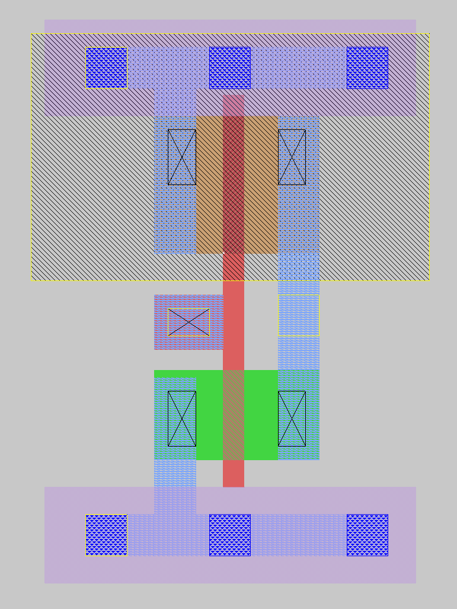

# Inverter demo with magic and Skywater 130 PDK

clone this repo recusively to get the spice models from https://foss-eda-tools.googlesource.com/skywater-pdk/libs/sky130_fd_pr

You will also need to get your $PDK_ROOT & $PDKPATH set correct for the .magicrc file to work and load the tech file. See https://github.com/efabless/openlane/#setting-up-the-pdk-skywater-pdk for details.

To see a video of me drawing this inverter see https://www.youtube.com/watch?v=IQ_DcWT_cbc

# Instructions

Start magic with the correct rcfile and load inverter.mag:

    make magic

To create the spice simulation file, in the command window type:

    extract
    ext2spice lvs
    ext2spice
    quit

Then in the shell type 

    make sim

to run the simulation. This uses the pre.spice and post.spice files to build a complete simulation that can be run with ngspice.

# Magic notes

## gui window

* useful to set grid on, snap to grid
* space - change tool
* box tool: left click sets one corner, right click sets next corner
* x - expand (shows non expanded cells)
* i - select top level cell
* s - select the areas under the cursor
* ^D - deletes material inside the box that matches what the cursor is over
* a - select what is inside the box
* b - prints out size of the box
* middle click any material or palette boxes on the left sets the box to that material

## useful command window commands

* what - what is selected
* ext - extract circuit from the design
* ext2spice lvs ; ext2spice subcircuit top on; ext2spice - setup ext2spice with the lvs settings (compatible with sky130), set export inside a subcircuit, then create the spice file to be used for simulation
* label NAME - create a label attached to whatever is selected
* measure - measures the box
* move up 10 - moves the selection up by 10
* copy up 10 - copies selection up by 10

# Attribution

Previous min2.tech and the lib files come from [VLSI course](https://www.udemy.com/course/vlsi-academy-custom-layout/) by Kunal Ghosh
