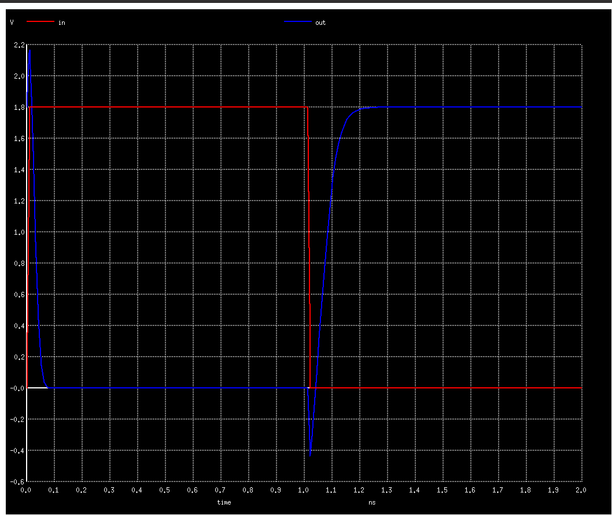

# Inverter demo with magic

to create the extracted netlist:

    magic inverter.mag

then in the command window type:

    extract
    ext2spice subcircuit top on
    ext2spice lvs
    ext2spice
    quit

then in the shell type 

    make

to run the simulation

# Magic notes

## gui window

* useful to set grid on, snap to grid
* space - change tool
* box tool: left click sets one corner, right click sets next corner
* x - expand (shows non expanded cells)
* i - select top level cell
* s - select the areas under the cursor
* ^D - deletes material inside the box that matches what the cursor is over
* a - select what is inside the box
* b - prints out size of the box
* middle click any material or palette boxes on the left sets the box to that material

## useful command window commands

* what - what is selected
* ext - extract circuit from the design
* ext2spice lvs ; ext2spice - setup ext2spice with the lvs settings (compatible with sky130), then create the spice file to be used for simulation
* label NAME - create a label attached to whatever is selected
* measure - measures the box
* move up 10 - moves the selection up by 10
* copy up 10 - copies selection up by 10

# PDK

* pdk install instructions here

# Questions / Todo

* where does the spice model come from? https://foss-eda-tools.googlesource.com/skywater-pdk/libs/sky130_fd_pr
* how to extract as before? ext2spice on cli doesn't work anymore (have to do from inside magic)
* how to get something I can simulate?

# Attribution

min2.tech and the lib files come from [VLSI course](https://www.udemy.com/course/vlsi-academy-custom-layout/) by Kunal Ghosh

